# Proyecto 1 - Redes de Computadoras 2

## Manual Técnico

**Universidad de San Carlos de Guatemala**  
**Facultad de Ingeniería**  
**Escuela de Ciencias**  
**Redes de Computadoras 2**  
**Primer Semestre 2026**

---

**Estudiante:** Diego Alessandro Constanza Padilla  
**Carnet:** 202300601  
**Fecha:** 21 de Marzo 2026

---

## Tabla de Contenidos

1. [Introducción](#introducción)
2. [Objetivos](#objetivos)
3. [Topología de Red](#topología-de-red)
4. [Direccionamiento IP](#direccionamiento-ip)
5. [Tecnologías Implementadas](#tecnologías-implementadas)
6. [Configuración de Dispositivos](#configuración-de-dispositivos)
7. [Comandos de Verificación](#comandos-de-verificación)
8. [Pruebas de Funcionalidad](#pruebas-de-funcionalidad)
9. [Conclusiones](#conclusiones)

---

## Introducción

Este manual técnico documenta la implementación de una red empresarial compleja que incluye dos edificios interconectados mediante switches multicapa y de capa 2. La red implementa tecnologías avanzadas como VLANs, VTP, EtherChannel (LACP y PAgP), enrutamiento dinámico EIGRP, listas de control de acceso (ACL) y configuración DHCP para la asignación automática de direcciones IP.

El proyecto simula un entorno corporativo donde se requiere segmentación de red, redundancia de enlaces, enrutamiento eficiente y políticas de seguridad granulares entre diferentes departamentos.

---

## Objetivos

### Objetivo General
Diseñar e implementar una red empresarial segmentada con alta disponibilidad, utilizando protocolos de enrutamiento dinámico y políticas de seguridad específicas.

### Objetivos Específicos
- Implementar VLANs utilizando VLSM para optimizar el uso de direcciones IP
- Configurar VTP (VLAN Trunking Protocol) para la administración centralizada de VLANs
- Establecer canales EtherChannel utilizando LACP y PAgP para redundancia y balanceo de carga
- Configurar enrutamiento dinámico mediante EIGRP para Par de dispositivos
- Implementar listas de control de acceso (ACL) para políticas de seguridad inter-VLAN
- Configurar servidores DHCP para asignación automática de direcciones IP
- Verificar la conectividad y funcionalidad de todos los servicios implementados

---

## Topología de Red

La topología implementada consta de:
- **9 Switches Multicapa 3560-24PS** (MS1-MS9): proporcionan enrutamiento entre VLANs y conectividad entre edificios
- **4 Switches Capa 2 2960-24TT** (S1-S4): proporcionan conectividad de acceso para los dispositivos finales
- **2 Servidores DHCP Server-PT**: asignación automática de direcciones IP
- **1 PC Admin**: equipo administrativo con acceso especial
- **8 Hosts en VLANs**: dispositivos finales distribuidos en 4 VLANs diferentes

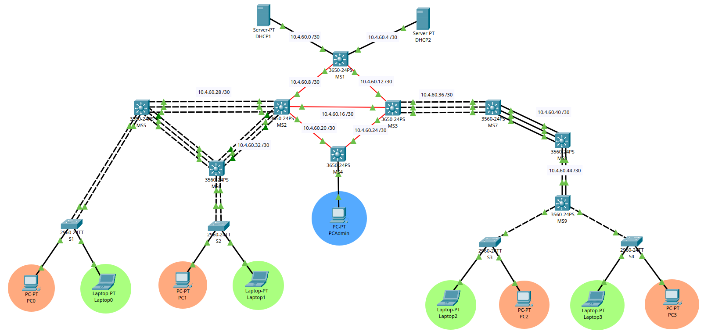

### Descripción de la Topología

La red se divide en dos edificios principales:

**Edificio Izquierdo:**
- MS5 y MS6: switches de distribución para VLANs 10 (Naranja) y 20 (Verde)
- S1 y S2: switches de acceso conectados mediante EtherChannel LACP
- Enlaces redundantes utilizando Port-Channel

**Edificio Derecho:**
- MS7, MS8 y MS9: switches de distribución para VLANs 30 (Naranja) y 40 (Verde)
- S3 y S4: switches de acceso
- Enlaces utilizando EtherChannel PAgP

**Core de la Red:**
- MS1: switch central que conecta con los servidores DHCP
- MS2: switch de distribución con enlaces EtherChannel LACP
- MS3: switch de distribución con enlaces EtherChannel PAgP
- MS4: switch de administración para VLAN Admin

---

## Direccionamiento IP

### Parámetros Base
- **Últimos 2 dígitos del carnet:** 60 (202300**60**1)
- **Carnet completo:** 202300601
- **Dominio VTP:** REDES2_202300601
- **Contraseña VTP:** 202300601

### Esquema de VLANs

Se utilizó **VLSM (Variable Length Subnet Mask)** para optimizar el uso del espacio de direcciones IP basado en la IP base **192.188.60.0/24**.

#### VLAN 10 - Naranja Edificio Izquierdo
- **Nombre:** VLAN_Naranja_EdificioIZQ_202300601
- **Número de VLAN:** 10
- **Red:** 192.188.60.0/28
- **Gateway:** 192.188.60.1
- **Broadcast:** 192.188.60.15
- **Máscara:** 255.255.255.240
- **Hosts disponibles:** 13

#### VLAN 20 - Verde Edificio Izquierdo
- **Nombre:** VLAN_Verde_EdificioIZQ_202300601
- **Número de VLAN:** 20
- **Red:** 192.188.60.16/28
- **Gateway:** 192.188.60.17
- **Broadcast:** 192.188.60.31
- **Máscara:** 255.255.255.240
- **Hosts disponibles:** 13

#### VLAN 30 - Naranja Edificio Derecho
- **Nombre:** VLAN_Naranja_EdificioDER_202300601
- **Número de VLAN:** 30
- **Red:** 192.188.60.32/28
- **Gateway:** 192.188.60.33
- **Broadcast:** 192.188.60.47
- **Máscara:** 255.255.255.240
- **Hosts disponibles:** 13

#### VLAN 40 - Verde Edificio Derecho
- **Nombre:** VLAN_Verde_EdificioDER_202300601
- **Número de VLAN:** 40
- **Red:** 192.188.60.48/28
- **Gateway:** 192.188.60.49
- **Broadcast:** 192.188.60.63
- **Máscara:** 255.255.255.240
- **Hosts disponibles:** 13

#### VLAN 99 - Administración
- **Nombre:** VLAN_Admin_202300601
- **Número de VLAN:** 99
- **Red:** 192.188.60.64/29
- **Gateway:** 192.188.60.65
- **Broadcast:** 192.188.60.71
- **Máscara:** 255.255.255.248
- **Hosts disponibles:** 6

### Esquema de Enrutamiento

Se utilizó **FLSM (Fixed Length Subnet Mask)** con máscara /30 para los enlaces punto a punto entre switches multicapa, basado en la IP base **10.4.60.0/30**.

| Enlace | Red | Dispositivo 1 | IP 1 | Dispositivo 2 | IP 2 |
|--------|-----|---------------|------|---------------|------|
| 1 | 10.4.60.0/30 | MS1 Gig1/0/1 | 10.4.60.1 | DHCP1 | 10.4.60.2 |
| 2 | 10.4.60.4/30 | MS1 Gig1/0/2 | 10.4.60.5 | DHCP2 | 10.4.60.6 |
| 3 | 10.4.60.8/30 | MS1 Gig1/1/1 | 10.4.60.9 | MS2 Gig1/1/1 | 10.4.60.10 |
| 4 | 10.4.60.12/30 | MS1 Gig1/1/2 | 10.4.60.13 | MS3 Gig1/1/1 | 10.4.60.14 |
| 5 | 10.4.60.16/30 | MS2 Gig1/1/2 | 10.4.60.17 | MS3 Gig1/1/2 | 10.4.60.18 |
| 6 | 10.4.60.20/30 | MS2 Gig1/1/3 | 10.4.60.21 | MS4 Gig1/1/1 | 10.4.60.22 |
| 7 | 10.4.60.24/30 | MS3 Gig1/1/3 | 10.4.60.25 | MS4 Gig1/1/2 | 10.4.60.26 |
| 8 | 10.4.60.28/30 | MS2 Po1 | 10.4.60.29 | MS5 Po1 | 10.4.60.30 |
| 9 | 10.4.60.32/30 | MS2 Po2 | 10.4.60.33 | MS6 Po2 | 10.4.60.34 |
| 10 | 10.4.60.36/30 | MS3 Po1 | 10.4.60.37 | MS7 Po1 | 10.4.60.38 |
| 11 | 10.4.60.40/30 | MS7 Po2 | 10.4.60.41 | MS8 Po1 | 10.4.60.42 |
| 12 | 10.4.60.44/30 | MS8 Po2 | 10.4.60.45 | MS9 Po1 | 10.4.60.46 |

### Configuración de Hosts

#### PC Admin
- **IP:** 192.188.60.66
- **Máscara:** 255.255.255.248
- **Gateway:** 192.188.60.65
- **VLAN:** 99 (Admin)

#### Servidor DHCP1
- **IP:** 10.4.60.2
- **Máscara:** 255.255.255.252
- **Gateway:** 10.4.60.1
- **Pools configurados:** VLAN 10 y VLAN 20

#### Servidor DHCP2
- **IP:** 10.4.60.6
- **Máscara:** 255.255.255.252
- **Gateway:** 10.4.60.5
- **Pools configurados:** VLAN 30 y VLAN 40

---

## Tecnologías Implementadas

### 1. VLAN (Virtual Local Area Network)

**Descripción:** Las VLANs permiten segmentar la red lógicamente, creando dominios de broadcast separados independientemente de la ubicación física de los dispositivos.

**Implementación en el proyecto:**
- Se crearon 5 VLANs: 10, 20, 30, 40 y 99
- Cada VLAN representa un departamento o función específica
- Los colores (Naranja y Verde) representan diferentes departamentos
- La VLAN 99 es exclusiva para administración

**Beneficios:**
- Seguridad mejorada mediante aislamiento de tráfico
- Reducción de dominios de broadcast
- Flexibilidad en la organización de la red
- Mejor gestión del ancho de banda

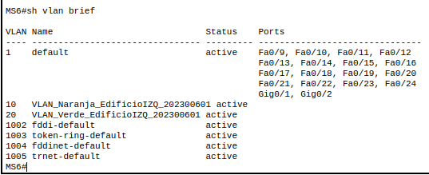
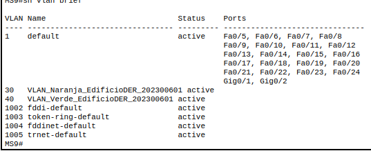
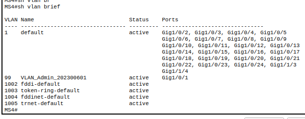

### 2. VTP (VLAN Trunking Protocol)

**Descripción:** VTP es un protocolo propietario de Cisco que propaga la configuración de VLANs a través de la red mediante enlaces trunk.

**Implementación en el proyecto:**
- **Dominio VTP:** REDES2_202300601
- **Contraseña VTP:** 202300601
- **Versión:** 2

**Roles configurados:**
- **MS6 y MS9:** VTP Server - crean y propagan VLANs
- **MS5, S1, S2, S3, S4:** VTP Client - reciben configuración de VLANs

**Comando base:**
```bash
vtp version 2
vtp domain REDES2_202300601
vtp password 202300601
vtp mode [server|client]
```

**Verificación:**
```bash
show vtp status
show vtp password
```

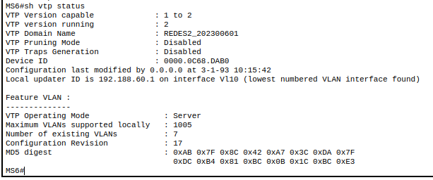
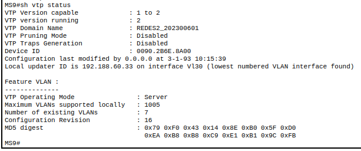

### 3. EtherChannel

**Descripción:** EtherChannel agrupa múltiples enlaces físicos en un único enlace lógico, proporcionando mayor ancho de banda y redundancia.

#### 3.1 LACP (Link Aggregation Control Protocol)

**Descripción:** Protocolo estándar IEEE 802.3ad que negocia dinámicamente la formación de canales EtherChannel.

**Implementación - Edificio Izquierdo:**
- **MS2 ↔ MS5:** Port-Channel 1 (Gig1/0/1-3)
- **MS6 ↔ MS5:** Port-Channel 1 (Fa0/4-6)
- **MS6 ↔ S1:** Port-Channel 3 (Fa0/7-8)
- **MS6 ↔ S2:** Port-Channel 3 (Fa0/7-8)

**Configuración:**
```bash
interface range [interfaces]
channel-group [número] mode active
```

**Modos LACP:**
- **active:** inicia negociación LACP activamente
- **passive:** espera negociación LACP

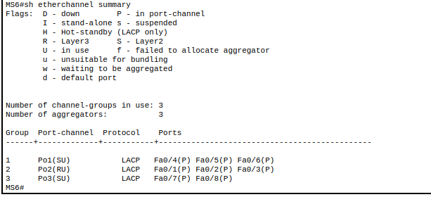

#### 3.2 PAgP (Port Aggregation Protocol)

**Descripción:** Protocolo propietario de Cisco para la agregación de enlaces.

**Implementación - Edificio Derecho:**
- **MS3 ↔ MS7:** Port-Channel 1 (Gig1/0/1-3)
- **MS7 ↔ MS8:** Port-Channel 2 (Fa0/4-6)
- **MS8 ↔ MS9:** Port-Channel 2 (Fa0/4-5)

**Configuración:**
```bash
interface range [interfaces]
channel-group [número] mode desirable
```

**Modos PAgP:**
- **desirable:** inicia negociación PAgP activamente
- **auto:** espera negociación PAgP

**Verificación EtherChannel:**
```bash
show etherchannel summary
show etherchannel port-channel
show interfaces port-channel [número]
```

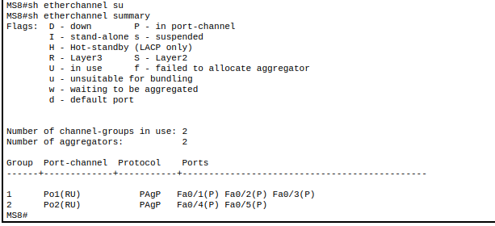

### 4. EIGRP (Enhanced Interior Gateway Routing Protocol)

**Descripción:** Protocolo de enrutamiento dinámico de vector distancia avanzado, propietario de Cisco, que utiliza el algoritmo DUAL para garantizar rutas libres de bucles.

**Implementación:**
- **AS (Autonomous System):** 1
- **Aplicado a:** Todos los switches multicapa (MS1-MS9)
- **Redes anunciadas:** Enlaces punto a punto y VLANs

**Características configuradas:**
- Deshabilitación de auto-summary para usar direccionamiento sin clases
- Anuncio de redes utilizando wildcard masks
- Convergencia rápida ante cambios de topología

**Configuración base:**
```bash
router EIGRP 1
network [red] [wildcard-mask]
no auto-summary
```

**Verificación:**
```bash
show ip eigrp neighbors
show ip eigrp topology
show ip route eigrp
show ip protocols
```

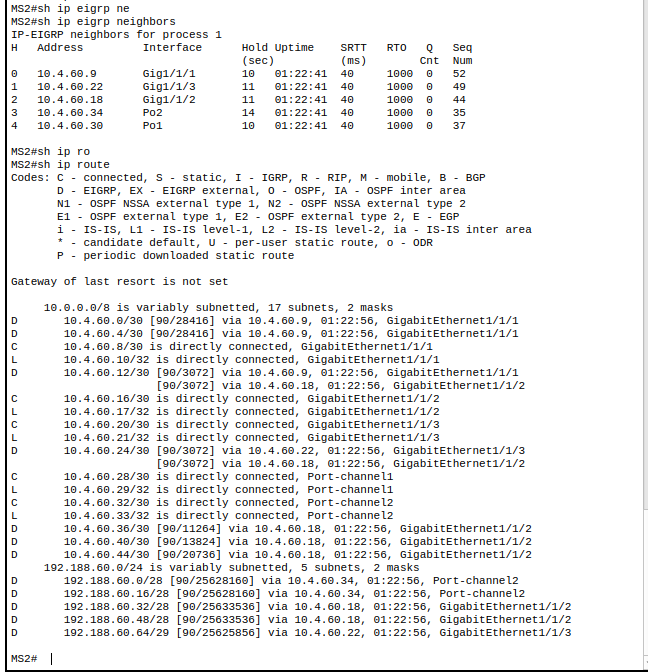

### 5. ACL (Access Control List)

**Descripción:** Listas de control de acceso que filtran tráfico basándose en criterios específicos, implementando políticas de seguridad.

**Requisitos de seguridad implementados:**

#### 5.1 Políticas entre VLANs de color
- Las VLANs Naranja (10 y 30) solo pueden comunicarse entre sí
- Las VLANs Verde (20 y 40) solo pueden comunicarse entre sí
- No se permite comunicación entre Naranja y Verde

**Implementado en:** MS6 (para VLANs 10 y 20) y MS9 (para VLANs 30 y 40)

#### 5.2 Políticas de VLAN Admin
- La VLAN Admin (99) puede comunicarse con todas las VLANs
- Ninguna VLAN puede iniciar comunicación hacia la VLAN Admin

**Implementado en:** MS4 (switch de administración)

**Configuración ACL en MS6 y MS9:**
```bash
access-list 100 permit icmp 192.188.60.0 0.0.0.15 192.188.60.48 0.0.0.15 echo
access-list 100 permit icmp 192.188.60.48 0.0.0.15 192.188.60.0 0.0.0.15 echo
access-list 100 permit icmp 192.188.60.16 0.0.0.15 192.188.60.32 0.0.0.15 echo
access-list 100 permit icmp 192.188.60.32 0.0.0.15 192.188.60.16 0.0.0.15 echo
access-list 100 deny icmp 192.188.60.0 0.0.0.15 192.188.60.16 0.0.0.15 echo
access-list 100 deny icmp 192.188.60.0 0.0.0.15 192.188.60.32 0.0.0.15 echo
access-list 100 deny icmp 192.188.60.48 0.0.0.15 192.188.60.16 0.0.0.15 echo
access-list 100 deny icmp 192.188.60.48 0.0.0.15 192.188.60.32 0.0.0.15 echo
access-list 100 deny icmp 192.188.60.16 0.0.0.15 192.188.60.0 0.0.0.15 echo
access-list 100 deny icmp 192.188.60.16 0.0.0.15 192.188.60.48 0.0.0.15 echo
access-list 100 deny icmp 192.188.60.32 0.0.0.15 192.188.60.0 0.0.0.15 echo
access-list 100 deny icmp 192.188.60.32 0.0.0.15 192.188.60.48 0.0.0.15 echo
access-list 100 permit ip any any

interface vlan 10
ip access-group 100 in

interface vlan 20
ip access-group 100 in
```

**Configuración ACL en MS4:**
```bash
access-list 100 deny icmp 192.188.60.0 0.0.0.15 192.188.60.64 0.0.0.7 echo
access-list 100 deny icmp 192.188.60.16 0.0.0.15 192.188.60.64 0.0.0.7 echo
access-list 100 deny icmp 192.188.60.32 0.0.0.15 192.188.60.64 0.0.0.7 echo
access-list 100 deny icmp 192.188.60.48 0.0.0.15 192.188.60.64 0.0.0.7 echo
access-list 100 permit ip any any

interface vlan 99
ip access-group 100 out
```

**Verificación:**
```bash
show access-lists
show ip interface [interface] | include access list
show access-lists 100
```

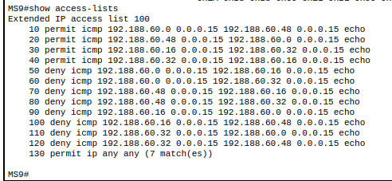
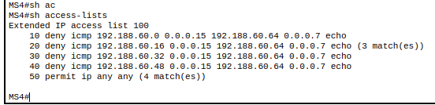


### 6. DHCP (Dynamic Host Configuration Protocol)

**Descripción:** Protocolo que asigna automáticamente direcciones IP y parámetros de configuración a dispositivos en la red.

**Implementación:**
- **DHCP1:** asigna IPs a VLANs 10 y 20 (Edificio Izquierdo)
- **DHCP2:** asigna IPs a VLANs 30 y 40 (Edificio Derecho)

**IP Helper-Address:** Configurado en las interfaces SVI de los switches multicapa para reenviar solicitudes DHCP broadcast a los servidores.

**Configuración en MS6:**
```bash
interface vlan 10
ip helper-address 10.4.60.2

interface vlan 20
ip helper-address 10.4.60.2
```

**Configuración en MS9:**
```bash
interface vlan 30
ip helper-address 10.4.60.6

interface vlan 40
ip helper-address 10.4.60.6
```

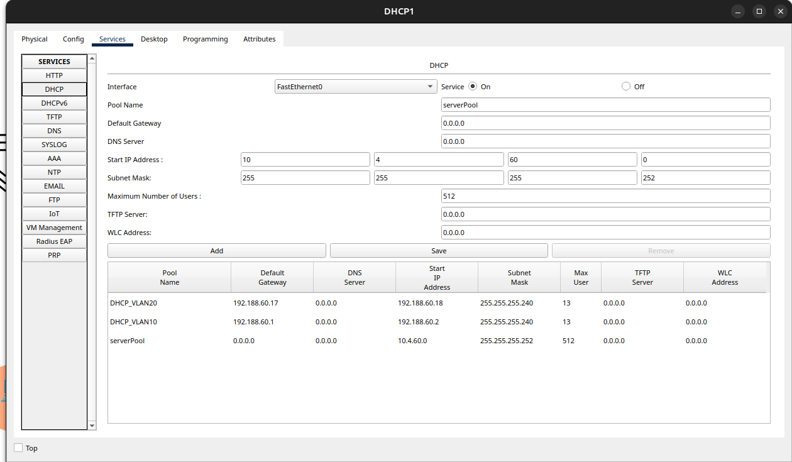

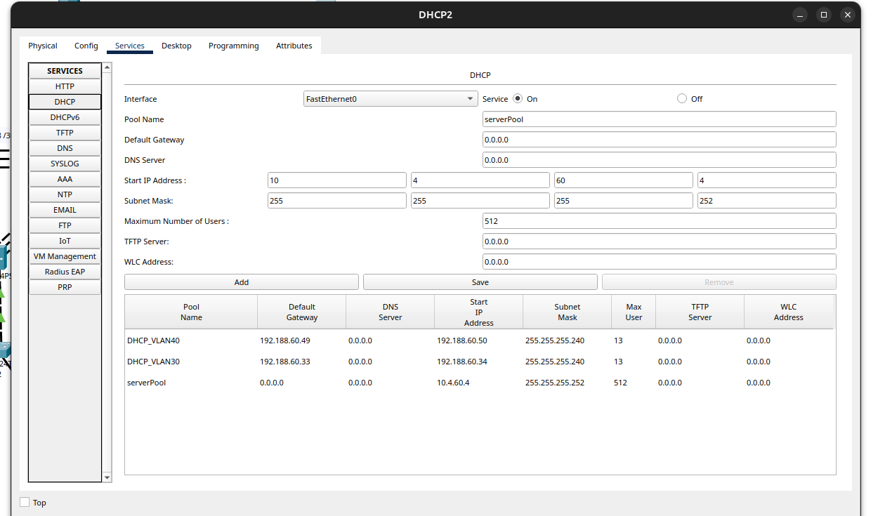

### 7. Inter-VLAN Routing

**Descripción:** Enrutamiento entre VLANs realizado por switches multicapa mediante interfaces SVI (Switched Virtual Interface).

**Implementación:**
- MS6: Gateway para VLANs 10 y 20
- MS9: Gateway para VLANs 30 y 40
- MS4: Gateway para VLAN 99

**Configuración:**
```bash
ip routing

interface vlan [número]
ip address [ip] [máscara]
no shutdown
```

**Verificación:**
```bash
show ip interface brief
show interfaces vlan [número]
show ip route connected
```

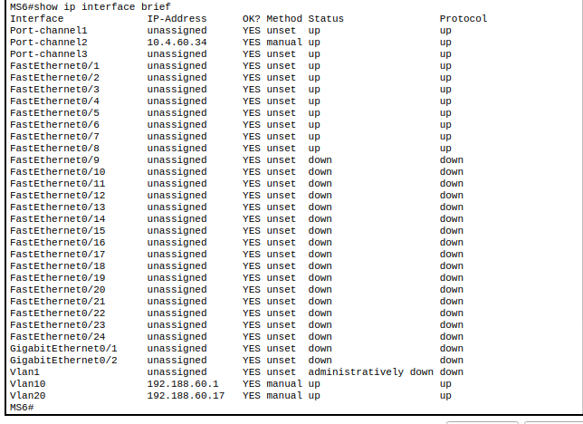

---

## Configuración de Dispositivos

### Switch Multicapa MS1 (Core Central)

**Función:** Switch central que conecta con los servidores DHCP y distribuye el tráfico al resto de la red.

**Configuración completa:**

```bash
enable
configure terminal

# Deshabilitar búsqueda DNS para evitar demoras
no ip domain-lookup

# Habilitar enrutamiento IP
ip routing

# Configuración de interfaz hacia DHCP1
interface gigabitEthernet 1/0/1
no switchport
ip address 10.4.60.1 255.255.255.252
no shutdown
exit

# Configuración de interfaz hacia DHCP2
interface gigabitEthernet 1/0/2
no switchport
ip address 10.4.60.5 255.255.255.252
no shutdown
exit

# Configuración de interfaz hacia MS2
interface gigabitEthernet 1/1/1
no switchport
ip address 10.4.60.9 255.255.255.252
no shutdown
exit

# Configuración de interfaz hacia MS3
interface gigabitEthernet 1/1/2
no switchport
ip address 10.4.60.13 255.255.255.252
no shutdown
exit

# Configuración de EIGRP
router eigrp 1
network 10.4.60.0 0.0.0.3
network 10.4.60.4 0.0.0.3
network 10.4.60.8 0.0.0.3
network 10.4.60.12 0.0.0.3
no auto-summary
exit

end
write memory
```

**Comandos de verificación:**
```bash
show ip interface brief
show ip route
show ip eigrp neighbors
show running-config
```

---

### Switch Multicapa MS2 (Distribución Edificio Izquierdo)

**Función:** Switch de distribución que conecta el core con el edificio izquierdo mediante EtherChannel LACP.

**Configuración completa:**

```bash
enable
configure terminal

no ip domain-lookup
ip routing

# Configuración de EtherChannel LACP hacia MS5
interface range gigabitEthernet 1/0/1-3
no switchport
channel-group 1 mode active
exit

interface port-channel 1
ip address 10.4.60.29 255.255.255.252
no shutdown
exit

# Configuración de EtherChannel LACP hacia MS6
interface range gigabitEthernet 1/0/4-6
no switchport
channel-group 2 mode active
exit

interface port-channel 2
ip address 10.4.60.33 255.255.255.252
no shutdown
exit

# Configuración de interfaz hacia MS1
interface gigabitEthernet 1/1/1
no switchport
ip address 10.4.60.10 255.255.255.252
no shutdown
exit

# Configuración de interfaz hacia MS3
interface gigabitEthernet 1/1/2
no switchport
ip address 10.4.60.17 255.255.255.252
no shutdown
exit

# Configuración de interfaz hacia MS4
interface gigabitEthernet 1/1/3
no switchport
ip address 10.4.60.21 255.255.255.252
no shutdown
exit

# Configuración de EIGRP
router eigrp 1
network 10.4.60.8 0.0.0.3
network 10.4.60.16 0.0.0.3
network 10.4.60.20 0.0.0.3
network 10.4.60.28 0.0.0.3
network 10.4.60.32 0.0.0.3
no auto-summary
exit

end
write memory
```

**Comandos de verificación:**
```bash
show etherchannel summary
show etherchannel port-channel
show ip eigrp neighbors
show interfaces port-channel 1
show interfaces port-channel 2
```

---

### Switch Multicapa MS3 (Distribución Edificio Derecho)

**Función:** Switch de distribución que conecta el core con el edificio derecho mediante EtherChannel PAgP.

**Configuración completa:**

```bash
enable
configure terminal

no ip domain-lookup
ip routing

# Configuración de EtherChannel PAgP hacia MS7
interface range gigabitEthernet 1/0/1-3
no switchport
channel-group 1 mode desirable
exit

interface port-channel 1
ip address 10.4.60.37 255.255.255.252
no shutdown
exit

# Configuración de interfaz hacia MS1
interface gigabitEthernet 1/1/1
no switchport
ip address 10.4.60.14 255.255.255.252
no shutdown
exit

# Configuración de interfaz hacia MS2
interface gigabitEthernet 1/1/2
no switchport
ip address 10.4.60.18 255.255.255.252
no shutdown
exit

# Configuración de interfaz hacia MS4
interface gigabitEthernet 1/1/3
no switchport
ip address 10.4.60.25 255.255.255.252
no shutdown
exit

# Configuración de EIGRP
router eigrp 1
network 10.4.60.12 0.0.0.3
network 10.4.60.16 0.0.0.3
network 10.4.60.24 0.0.0.3
network 10.4.60.36 0.0.0.3
no auto-summary
exit

end
write memory
```

**Comandos de verificación:**
```bash
show etherchannel summary
show interfaces port-channel 1
show ip eigrp neighbors
show ip route
```

---

### Switch Multicapa MS4 (Administración)

**Función:** Switch de administración que gestiona la VLAN 99 y aplica políticas de seguridad para la red administrativa.

**Configuración completa:**

```bash
enable
configure terminal

no ip domain-lookup
ip routing

# Creación de VLAN Admin
vlan 99
name VLAN_Admin_202300601
exit

# Configuración de interfaz de acceso para PC Admin
interface gigabitEthernet 1/0/1
switchport mode access
switchport access vlan 99
exit

# Configuración de interfaz hacia MS2
interface gigabitEthernet 1/1/1
no switchport
ip address 10.4.60.22 255.255.255.252
no shutdown
exit

# Configuración de interfaz hacia MS3
interface gigabitEthernet 1/1/2
no switchport
ip address 10.4.60.26 255.255.255.252
no shutdown
exit

# Configuración de SVI VLAN 99
interface vlan 99
ip address 192.188.60.65 255.255.255.248
no shutdown
exit

# Configuración de EIGRP
router eigrp 1
network 10.4.60.20 0.0.0.3
network 10.4.60.24 0.0.0.3
network 192.188.60.64 0.0.0.7
no auto-summary
exit

# Configuración de ACL para proteger VLAN Admin
# Bloquea tráfico ICMP desde VLANs operativas hacia Admin
access-list 100 deny icmp 192.188.60.0 0.0.0.15 192.188.60.64 0.0.0.7 echo
access-list 100 deny icmp 192.188.60.16 0.0.0.15 192.188.60.64 0.0.0.7 echo
access-list 100 deny icmp 192.188.60.32 0.0.0.15 192.188.60.64 0.0.0.7 echo
access-list 100 deny icmp 192.188.60.48 0.0.0.15 192.188.60.64 0.0.0.7 echo
access-list 100 permit ip any any

# Aplicación de ACL en dirección de salida
interface vlan 99
ip access-group 100 out
exit

end
write memory
```

**Comandos de verificación:**
```bash
show vlan brief
show interfaces vlan 99
show access-lists
show ip access-lists 100
show ip eigrp neighbors
```

---

### Switch Multicapa MS5 (Distribución VLANs 10 y 20)

**Función:** Switch cliente VTP que recibe configuración de VLANs y conecta mediante EtherChannel LACP.

**Configuración completa:**

```bash
enable
configure terminal

no ip domain-lookup
ip routing

# Configuración de VTP como cliente
vtp version 2
vtp domain REDES2_202300601
vtp password 202300601
vtp mode client

# Configuración de EtherChannel LACP hacia MS2
interface range fastEthernet 0/1-3
no switchport
channel-group 1 mode active
exit

interface port-channel 1
ip address 10.4.60.30 255.255.255.252
no shutdown
exit

# Configuración de EtherChannel hacia MS6 (trunk)
interface range fastEthernet 0/4-6
channel-group 2 mode active
exit

interface port-channel 2
switchport trunk encapsulation dot1q
switchport mode trunk
switchport trunk allowed vlan 10,20
no shutdown
exit

# Configuración de EtherChannel hacia switches de acceso (trunk)
interface range fastEthernet 0/7-8
channel-group 3 mode active
exit

interface port-channel 3
switchport trunk encapsulation dot1q
switchport mode trunk
switchport trunk allowed vlan 10,20
no shutdown
exit

# Configuración de EIGRP
router eigrp 1
network 10.4.60.28 0.0.0.3
network 192.188.60.0 0.0.0.15
network 192.188.60.16 0.0.0.15
no auto-summary
exit

end
write memory
```

**Comandos de verificación:**
```bash
show vtp status
show vlan brief
show etherchannel summary
show interfaces trunk
show spanning-tree
```

---

### Switch Multicapa MS6 (Gateway VLANs 10 y 20 - Servidor VTP)

**Función:** Switch servidor VTP que crea VLANs 10 y 20, actúa como gateway y aplica ACLs de seguridad.

**Configuración completa:**

```bash
enable
configure terminal

no ip domain-lookup
ip routing

# Configuración de VTP como servidor
vtp version 2
vtp domain REDES2_202300601
vtp password 202300601
vtp mode server

# Creación de VLANs
vlan 10
name VLAN_Naranja_EdificioIZQ_202300601
exit

vlan 20
name VLAN_Verde_EdificioIZQ_202300601
exit

# Configuración de SVI VLAN 10 con IP Helper
interface vlan 10
ip address 192.188.60.1 255.255.255.240
ip helper-address 10.4.60.2
no shutdown
exit

# Configuración de SVI VLAN 20 con IP Helper
interface vlan 20
ip address 192.188.60.17 255.255.255.240
ip helper-address 10.4.60.2
no shutdown
exit

# Configuración de EtherChannel LACP hacia MS5
interface range fastEthernet 0/4-6
channel-group 1 mode active
exit

interface port-channel 1
switchport trunk encapsulation dot1q
switchport mode trunk
switchport trunk allowed vlan 10,20
no shutdown
exit

# Configuración de EtherChannel hacia MS2
interface range fastEthernet 0/1-3
no switchport
channel-group 2 mode active
exit

interface port-channel 2
ip address 10.4.60.34 255.255.255.252
no shutdown
exit

# Configuración de EtherChannel hacia switches de acceso
interface range fastEthernet 0/7-8
channel-group 3 mode active
exit

interface port-channel 3
switchport trunk encapsulation dot1q
switchport mode trunk
switchport trunk allowed vlan 10,20
no shutdown
exit

# Configuración de EIGRP
router eigrp 1
network 10.4.60.32 0.0.0.3
network 192.188.60.0 0.0.0.15
network 192.188.60.16 0.0.0.15
no auto-summary
exit

# Configuración de ACL para políticas inter-VLAN
# Permite comunicación Naranja-Naranja (10-30)
access-list 100 permit icmp 192.188.60.0 0.0.0.15 192.188.60.48 0.0.0.15 echo
access-list 100 permit icmp 192.188.60.48 0.0.0.15 192.188.60.0 0.0.0.15 echo

# Permite comunicación Verde-Verde (20-40)
access-list 100 permit icmp 192.188.60.16 0.0.0.15 192.188.60.32 0.0.0.15 echo
access-list 100 permit icmp 192.188.60.32 0.0.0.15 192.188.60.16 0.0.0.15 echo

# Bloquea comunicación Naranja-Verde
access-list 100 deny icmp 192.188.60.0 0.0.0.15 192.188.60.16 0.0.0.15 echo
access-list 100 deny icmp 192.188.60.0 0.0.0.15 192.188.60.32 0.0.0.15 echo
access-list 100 deny icmp 192.188.60.48 0.0.0.15 192.188.60.16 0.0.0.15 echo
access-list 100 deny icmp 192.188.60.48 0.0.0.15 192.188.60.32 0.0.0.15 echo

# Bloquea comunicación Verde-Naranja
access-list 100 deny icmp 192.188.60.16 0.0.0.15 192.188.60.0 0.0.0.15 echo
access-list 100 deny icmp 192.188.60.16 0.0.0.15 192.188.60.48 0.0.0.15 echo
access-list 100 deny icmp 192.188.60.32 0.0.0.15 192.188.60.0 0.0.0.15 echo
access-list 100 deny icmp 192.188.60.32 0.0.0.15 192.188.60.48 0.0.0.15 echo

# Permite todo el demás tráfico
access-list 100 permit ip any any

# Aplicación de ACL en interfaces VLAN
interface vlan 10
ip access-group 100 in
exit

interface vlan 20
ip access-group 100 in
exit

end
write memory
```

**Comandos de verificación:**
```bash
show vtp status
show vlan brief
show ip interface brief
show access-lists 100
show ip dhcp binding
show etherchannel summary
```

---

### Switch Multicapa MS7 (Distribución Edificio Derecho)

**Función:** Interconecta switches MS3 y MS8 mediante EtherChannel PAgP.

**Configuración completa:**

```bash
enable
configure terminal

no ip domain-lookup
ip routing

# Configuración de EtherChannel PAgP hacia MS3
interface range fastEthernet 0/1-3
no switchport
channel-group 1 mode desirable
exit

interface port-channel 1
ip address 10.4.60.38 255.255.255.252
no shutdown
exit

# Configuración de EtherChannel PAgP hacia MS8
interface range fastEthernet 0/4-6
no switchport
channel-group 2 mode desirable
exit

interface port-channel 2
ip address 10.4.60.41 255.255.255.252
no shutdown
exit

# Configuración de EIGRP
router eigrp 1
network 10.4.60.36 0.0.0.3
network 10.4.60.40 0.0.0.3
no auto-summary
exit

end
write memory
```

**Comandos de verificación:**
```bash
show etherchannel summary
show ip eigrp neighbors
show ip route
```

---

### Switch Multicapa MS8 (Distribución Edificio Derecho)

**Función:** Conecta MS7 con MS9 mediante EtherChannel PAgP.

**Configuración completa:**

```bash
enable
configure terminal

no ip domain-lookup
ip routing

# Configuración de EtherChannel PAgP hacia MS7
interface range fastEthernet 0/1-3
no switchport
channel-group 1 mode desirable
exit

interface port-channel 1
ip address 10.4.60.42 255.255.255.252
no shutdown
exit

# Configuración de EtherChannel PAgP hacia MS9
interface range fastEthernet 0/4-5
no switchport
channel-group 2 mode desirable
exit

interface port-channel 2
ip address 10.4.60.45 255.255.255.252
no shutdown
exit

# Configuración de EIGRP
router eigrp 1
network 10.4.60.40 0.0.0.3
network 10.4.60.44 0.0.0.3
no auto-summary
exit

end
write memory
```

**Comandos de verificación:**
```bash
show etherchannel summary
show ip eigrp neighbors
show ip interface brief
```

---

### Switch Multicapa MS9 (Gateway VLANs 30 y 40 - Servidor VTP)

**Función:** Switch servidor VTP para VLANs 30 y 40, gateway y aplicación de ACLs.

**Configuración completa:**

```bash
enable
configure terminal

no ip domain-lookup
ip routing

# Configuración de VTP como servidor
vtp version 2
vtp domain REDES2_202300601
vtp password 202300601
vtp mode server

# Creación de VLANs
vlan 30
name VLAN_Naranja_EdificioDER_202300601
exit

vlan 40
name VLAN_Verde_EdificioDER_202300601
exit

# Configuración de SVI VLAN 30 con IP Helper
interface vlan 30
ip address 192.188.60.33 255.255.255.240
ip helper-address 10.4.60.6
no shutdown
exit

# Configuración de SVI VLAN 40 con IP Helper
interface vlan 40
ip address 192.188.60.49 255.255.255.240
ip helper-address 10.4.60.6
no shutdown
exit

# Configuración de EtherChannel PAgP hacia MS8
interface range fastEthernet 0/1-2
no switchport
channel-group 1 mode desirable
exit

interface port-channel 1
ip address 10.4.60.46 255.255.255.252
no shutdown
exit

# Configuración de enlaces trunk hacia switches de acceso
interface fastEthernet 0/3
switchport mode trunk
switchport trunk encapsulation dot1q
switchport trunk allowed vlan 30,40
no shutdown
exit

interface fastEthernet 0/4
switchport mode trunk
switchport trunk encapsulation dot1q
switchport trunk allowed vlan 30,40
no shutdown
exit

# Configuración de EIGRP
router eigrp 1
network 10.4.60.44 0.0.0.3
network 192.188.60.32 0.0.0.15
network 192.188.60.48 0.0.0.15
no auto-summary
exit

# Configuración de ACL para políticas inter-VLAN
# Permite comunicación Naranja-Naranja (30-10)
access-list 100 permit icmp 192.188.60.0 0.0.0.15 192.188.60.48 0.0.0.15 echo
access-list 100 permit icmp 192.188.60.48 0.0.0.15 192.188.60.0 0.0.0.15 echo

# Permite comunicación Verde-Verde (40-20)
access-list 100 permit icmp 192.188.60.16 0.0.0.15 192.188.60.32 0.0.0.15 echo
access-list 100 permit icmp 192.188.60.32 0.0.0.15 192.188.60.16 0.0.0.15 echo

# Bloquea comunicación Naranja-Verde
access-list 100 deny icmp 192.188.60.0 0.0.0.15 192.188.60.16 0.0.0.15 echo
access-list 100 deny icmp 192.188.60.0 0.0.0.15 192.188.60.32 0.0.0.15 echo
access-list 100 deny icmp 192.188.60.48 0.0.0.15 192.188.60.16 0.0.0.15 echo
access-list 100 deny icmp 192.188.60.48 0.0.0.15 192.188.60.32 0.0.0.15 echo

# Bloquea comunicación Verde-Naranja
access-list 100 deny icmp 192.188.60.16 0.0.0.15 192.188.60.0 0.0.0.15 echo
access-list 100 deny icmp 192.188.60.16 0.0.0.15 192.188.60.48 0.0.0.15 echo
access-list 100 deny icmp 192.188.60.32 0.0.0.15 192.188.60.0 0.0.0.15 echo
access-list 100 deny icmp 192.188.60.32 0.0.0.15 192.188.60.48 0.0.0.15 echo

# Permite todo el demás tráfico
access-list 100 permit ip any any

# Aplicación de ACL en interfaces VLAN
interface vlan 30
ip access-group 100 in
exit

interface vlan 40
ip access-group 100 in
exit

end
write memory
```

**Comandos de verificación:**
```bash
show vtp status
show vlan brief
show ip interface brief
show access-lists 100
show interfaces trunk
```

---

### Switch Capa 2 S1 (Acceso Edificio Izquierdo)

**Función:** Switch de acceso para usuarios finales en VLANs 10 y 20.

**Configuración completa:**

```bash
enable
configure terminal

no ip domain-lookup

# Configuración de VTP como cliente
vtp version 2
vtp domain REDES2_202300601
vtp password 202300601
vtp mode client

# Configuración de EtherChannel LACP hacia MS6
interface range fastEthernet 0/1-2
channel-group 1 mode active
exit

interface port-channel 1
switchport mode trunk
switchport trunk allowed vlan 10,20
no shutdown
exit

# Configuración de puerto de acceso VLAN 10
interface fastEthernet 0/3
switchport mode access
switchport access vlan 10
no shutdown
exit

# Configuración de puerto de acceso VLAN 20
interface fastEthernet 0/4
switchport mode access
switchport access vlan 20
no shutdown
exit

end
write memory
```

**Comandos de verificación:**
```bash
show vlan brief
show interfaces trunk
show etherchannel summary
show vtp status
```

---

### Switch Capa 2 S2 (Acceso Edificio Izquierdo)

**Función:** Switch de acceso adicional para VLANs 10 y 20.

**Configuración completa:**

```bash
enable
configure terminal

no ip domain-lookup

# Configuración de VTP como cliente
vtp version 2
vtp domain REDES2_202300601
vtp password 202300601
vtp mode client

# Configuración de EtherChannel LACP hacia MS6
interface range fastEthernet 0/1-2
channel-group 1 mode active
exit

interface port-channel 1
switchport mode trunk
switchport trunk allowed vlan 10,20
no shutdown
exit

# Configuración de puerto de acceso VLAN 10
interface fastEthernet 0/3
switchport mode access
switchport access vlan 10
no shutdown
exit

# Configuración de puerto de acceso VLAN 20
interface fastEthernet 0/4
switchport mode access
switchport access vlan 20
no shutdown
exit

end
write memory
```

**Comandos de verificación:**
```bash
show vlan brief
show interfaces status
show etherchannel summary
```

---

### Switch Capa 2 S3 (Acceso Edificio Derecho)

**Función:** Switch de acceso para usuarios finales en VLANs 30 y 40.

**Configuración completa:**

```bash
enable
configure terminal

no ip domain-lookup

# Configuración de VTP como cliente
vtp version 2
vtp domain REDES2_202300601
vtp password 202300601
vtp mode client

# Configuración de enlace trunk hacia MS9
interface fastEthernet 0/1
switchport mode trunk
switchport trunk allowed vlan 30,40
no shutdown
exit

# Configuración de puerto de acceso VLAN 30
interface fastEthernet 0/2
switchport mode access
switchport access vlan 30
no shutdown
exit

# Configuración de puerto de acceso VLAN 40
interface fastEthernet 0/3
switchport mode access
switchport access vlan 40
no shutdown
exit

end
write memory
```

**Comandos de verificación:**
```bash
show vlan brief
show interfaces trunk
show vtp status
show spanning-tree vlan 30
show spanning-tree vlan 40
```

---

### Switch Capa 2 S4 (Acceso Edificio Derecho)

**Función:** Switch de acceso adicional para VLANs 30 y 40.

**Configuración completa:**

```bash
enable
configure terminal

no ip domain-lookup

# Configuración de VTP como cliente
vtp version 2
vtp domain REDES2_202300601
vtp password 202300601
vtp mode client

# Configuración de enlace trunk hacia MS9
interface fastEthernet 0/1
switchport mode trunk
switchport trunk allowed vlan 30,40
no shutdown
exit

# Configuración de puerto de acceso VLAN 30
interface fastEthernet 0/2
switchport mode access
switchport access vlan 30
no shutdown
exit

# Configuración de puerto de acceso VLAN 40
interface fastEthernet 0/3
switchport mode access
switchport access vlan 40
no shutdown
exit

end
write memory
```

**Comandos de verificación:**
```bash
show vlan brief
show interfaces fastEthernet 0/1 trunk
show mac address-table
```

---

## Comandos de Verificación

### Verificación General del Sistema

```bash
# Ver información del dispositivo
show version

# Ver configuración en ejecución
show running-config

# Ver configuración guardada
show startup-config

# Guardar configuración
write memory
# o
copy running-config startup-config
```

### Verificación de Interfaces

```bash
# Ver resumen de interfaces
show ip interface brief

# Ver estado detallado de una interfaz
show interfaces [interface]

# Ver estadísticas de interfaces
show interfaces [interface] stats

# Ver errores en interfaces
show interfaces [interface] | include error

# Ver estado de puertos trunk
show interfaces trunk

# Ver estado de puertos de acceso
show interfaces status
```

### Verificación de VLANs y VTP

```bash
# Ver VLANs configuradas
show vlan brief

# Ver detalles completos de VLANs
show vlan

# Ver información de VTP
show vtp status

# Ver contraseña VTP
show vtp password

# Ver interfaces por VLAN
show vlan id [número]

# Ver interfaces trunk y VLANs permitidas
show interfaces trunk
```

### Verificación de EtherChannel

```bash
# Ver resumen de Port-Channels
show etherchannel summary

# Ver detalles de Port-Channel específico
show etherchannel [número] detail

# Ver configuración de Port-Channel
show interfaces port-channel [número]

# Ver protocolo EtherChannel (LACP o PAgP)
show etherchannel protocol

# Ver balanceo de carga
show etherchannel load-balance
```

### Verificación de Enrutamiento EIGRP

```bash
# Ver vecinos EIGRP
show ip eigrp neighbors

# Ver topología EIGRP
show ip eigrp topology

# Ver tabla de enrutamiento
show ip route

# Ver rutas EIGRP específicamente
show ip route eigrp

# Ver protocolos de enrutamiento configurados
show ip protocols

# Ver interfaces participando en EIGRP
show ip eigrp interfaces

# Ver estadísticas de EIGRP
show ip eigrp traffic
```

### Verificación de ACLs

```bash
# Ver todas las ACLs configuradas
show access-lists

# Ver ACL específica
show access-lists [número]

# Ver ACL aplicadas a interfaces
show ip interface [interface] | include access list

# Ver solo ACLs IP
show ip access-lists

# Ver contadores de matches en ACLs
show access-lists [número] | include matches
```

### Verificación de DHCP

```bash
# Ver bindings DHCP activos
show ip dhcp binding

# Ver pools DHCP configurados
show ip dhcp pool

# Ver estadísticas del servidor DHCP
show ip dhcp server statistics

# Ver configuración de IP helper
show run | include helper-address

# Verificar IPs asignadas en clientes
ipconfig /all  # En Windows
ip addr show   # En Linux
```

### Verificación de Conectividad

```bash
# Verificar conectividad básica
ping [dirección IP]

# Ping extendido (especificar origen)
ping
# Luego ingresar opciones interactivamente

# Verificar ruta de paquetes
traceroute [dirección IP]

# Verificar ARP
show ip arp

# Verificar tabla MAC
show mac address-table

# Verificar tabla MAC por VLAN
show mac address-table vlan [número]
```

### Verificación de Spanning Tree

```bash
# Ver estado de Spanning Tree
show spanning-tree

# Ver Spanning Tree por VLAN
show spanning-tree vlan [número]

# Ver resumen de Spanning Tree
show spanning-tree summary

# Ver root bridge
show spanning-tree root
```

### Comandos de Diagnóstico

```bash
# Ver logs del sistema
show logging

# Ver procesos de CPU
show processes cpu

# Ver uso de memoria
show memory

# Ver estadísticas de interfaces
show interfaces [interface] counters

# Depurar EIGRP (usar con precaución en producción)
debug eigrp packets

# Depurar VTP (usar con precaución)
debug sw-vlan vtp events

# Desactivar debugging
undebug all
# o
no debug all
```

---

## Pruebas de Funcionalidad

### Escenarios de Prueba

#### 1. Conectividad Intra-VLAN

**Objetivo:** Verificar que los dispositivos dentro de la misma VLAN puedan comunicarse.

**Pruebas:**

**a) VLAN 10 - Naranja Edificio Izquierdo**
```bash
# Desde PC en VLAN 10 hacia otro PC en VLAN 10
ping 192.188.60.2  # Ejemplo de PC1 a PC2 en VLAN 10
```
**Resultado esperado:** Respuesta exitosa con 0% de pérdida de paquetes.

**b) VLAN 20 - Verde Edificio Izquierdo**
```bash
# Desde PC en VLAN 20 hacia otro PC en VLAN 20
ping 192.188.60.18  # Ejemplo de PC en VLAN 20
```
**Resultado esperado:** Respuesta exitosa con 0% de pérdida de paquetes.

**c) VLAN 30 - Naranja Edificio Derecho**
```bash
# Desde PC en VLAN 30 hacia otro PC en VLAN 30
ping 192.188.60.34  # Ejemplo de PC en VLAN 30
```
**Resultado esperado:** Respuesta exitosa con 0% de pérdida de paquetes.

**d) VLAN 40 - Verde Edificio Derecho**
```bash
# Desde PC en VLAN 40 hacia otro PC en VLAN 40
ping 192.188.60.50  # Ejemplo de PC en VLAN 40
```
**Resultado esperado:** Respuesta exitosa con 0% de pérdida de paquetes.

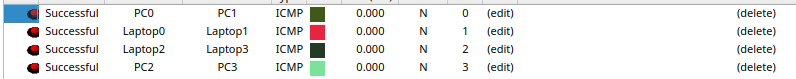

---

#### 2. Conectividad Inter-VLAN Permitida (Mismo Color)

**Objetivo:** Verificar que VLANs del mismo color puedan comunicarse entre edificios.

**Pruebas:**

**a) VLAN 10 (Naranja Izq) ↔ VLAN 30 (Naranja Der)**
```bash
# Desde PC en VLAN 10 hacia PC en VLAN 30
ping 192.188.60.34
```
**Resultado esperado:** Respuesta exitosa - las VLANs Naranja pueden comunicarse.

```bash
# Desde PC en VLAN 30 hacia PC en VLAN 10
ping 192.188.60.2
```
**Resultado esperado:** Respuesta exitosa - comunicación bidireccional.

**b) VLAN 20 (Verde Izq) ↔ VLAN 40 (Verde Der)**
```bash
# Desde PC en VLAN 20 hacia PC en VLAN 40
ping 192.188.60.50
```
**Resultado esperado:** Respuesta exitosa - las VLANs Verde pueden comunicarse.

```bash
# Desde PC en VLAN 40 hacia PC en VLAN 20
ping 192.188.60.18
```
**Resultado esperado:** Respuesta exitosa - comunicación bidireccional.

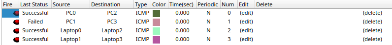

---

#### 3. Conectividad Inter-VLAN Bloqueada (Diferente Color)

**Objetivo:** Verificar que las ACLs bloquean comunicación entre VLANs de diferente color.

**Pruebas:**

**a) VLAN 10 (Naranja) → VLAN 20 (Verde) - Bloqueado**
```bash
# Desde PC en VLAN 10 intentar ping a PC en VLAN 20
ping 192.188.60.18
```
**Resultado esperado:** Request timeout o Destination unreachable - bloqueado por ACL.

**b) VLAN 10 (Naranja) → VLAN 40 (Verde) - Bloqueado**
```bash
# Desde PC en VLAN 10 intentar ping a PC en VLAN 40
ping 192.188.60.50
```
**Resultado esperado:** Request timeout - bloqueado por ACL.

**c) VLAN 20 (Verde) → VLAN 30 (Naranja) - Bloqueado**
```bash
# Desde PC en VLAN 20 intentar ping a PC en VLAN 30
ping 192.188.60.34
```
**Resultado esperado:** Request timeout - bloqueado por ACL.

**d) VLAN 30 (Naranja) → VLAN 40 (Verde) - Bloqueado**
```bash
# Desde PC en VLAN 30 intentar ping a PC en VLAN 40
ping 192.188.60.50
```
**Resultado esperado:** Request timeout - bloqueado por ACL.

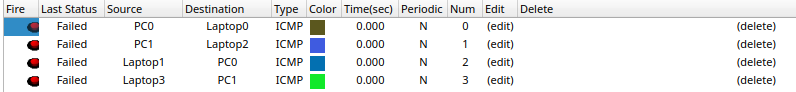

---

#### 4. Conectividad VLAN Admin

**Objetivo:** Verificar que la VLAN Admin puede comunicarse con todas las VLANs, pero ninguna VLAN puede iniciar comunicación hacia Admin.

**Pruebas:**

**a) Admin → VLAN 10**
```bash
# Desde PC Admin (192.188.60.66) hacia PC en VLAN 10
ping 192.188.60.2
```
**Resultado esperado:** Respuesta exitosa - Admin puede comunicarse con VLAN 10.

**b) Admin → VLAN 20**
```bash
# Desde PC Admin hacia PC en VLAN 20
ping 192.188.60.18
```
**Resultado esperado:** Respuesta exitosa.

**c) Admin → VLAN 30**
```bash
# Desde PC Admin hacia PC en VLAN 30
ping 192.188.60.34
```
**Resultado esperado:** Respuesta exitosa.

**d) Admin → VLAN 40**
```bash
# Desde PC Admin hacia PC en VLAN 40
ping 192.188.60.50
```
**Resultado esperado:** Respuesta exitosa.

**e) VLAN 10 → Admin (Bloqueado)**
```bash
# Desde PC en VLAN 10 intentar ping a PC Admin
ping 192.188.60.66
```
**Resultado esperado:** Request timeout - bloqueado por ACL en MS4.

**f) VLAN 20 → Admin (Bloqueado)**
```bash
# Desde PC en VLAN 20 intentar ping a PC Admin
ping 192.188.60.66
```
**Resultado esperado:** Request timeout - bloqueado por ACL.

**g) VLAN 30 → Admin (Bloqueado)**
```bash
# Desde PC en VLAN 30 intentar ping a PC Admin
ping 192.188.60.66
```
**Resultado esperado:** Request timeout - bloqueado por ACL.

**h) VLAN 40 → Admin (Bloqueado)**
```bash
# Desde PC en VLAN 40 intentar ping a PC Admin
ping 192.188.60.66
```
**Resultado esperado:** Request timeout - bloqueado por ACL.

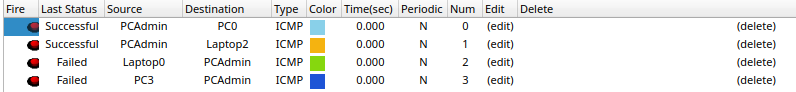

---

#### 5. Verificación de DHCP

**Objetivo:** Verificar que los clientes DHCP reciben direcciones IP automáticamente.

**Pruebas:**

**a) Cliente en VLAN 10**
```bash
# En PC configurado como DHCP en VLAN 10
ipconfig /renew  # Windows
# o
dhclient -r && dhclient  # Linux

# Verificar IP asignada
ipconfig /all  # Windows
```
**Resultado esperado:** IP en rango 192.188.60.2-192.188.60.14

**b) Cliente en VLAN 20**
```bash
# Renovar IP
ipconfig /renew
```
**Resultado esperado:** IP en rango 192.188.60.18-192.188.60.30

**c) Cliente en VLAN 30**
```bash
# Renovar IP
ipconfig /renew
```
**Resultado esperado:** IP en rango 192.188.60.34-192.188.60.46

**d) Cliente en VLAN 40**
```bash
# Renovar IP
ipconfig /renew
```
**Resultado esperado:** IP en rango 192.188.60.50-192.188.60.62

**e) Verificación en servidor DHCP**
```bash
# En servidor DHCP1 o DHCP2
show ip dhcp binding
```
**Resultado esperado:** Lista de IPs asignadas con MACs de clientes.

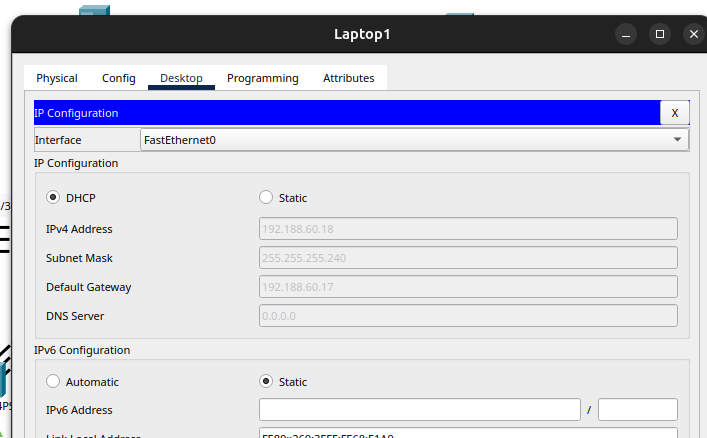

---

## Conclusiones

### Logros del Proyecto

1. **Segmentación Efectiva de Red**
   - Se implementaron exitosamente 5 VLANs con VLSM, optimizando el uso de direcciones IP
   - Cada departamento cuenta con su propio dominio de broadcast aislado
   - La segmentación mejora la seguridad y facilita la administración

2. **Alta Disponibilidad**
   - Los enlaces EtherChannel proporcionan redundancia y balanceo de carga
   - LACP en edificio izquierdo y PAgP en edificio derecho funcionan correctamente
   - La red puede tolerar fallas de enlaces individuales sin pérdida de conectividad

3. **Enrutamiento Dinámico Eficiente**
   - EIGRP proporciona convergencia rápida ante cambios de topología
   - Las rutas se calculan automáticamente utilizando el algoritmo DUAL
   - La métrica EIGRP selecciona las mejores rutas considerando ancho de banda y retardo

4. **Administración Centralizada de VLANs**
   - VTP simplifica la gestión de VLANs en switches de capa 2
   - Los cambios en servidores VTP se propagan automáticamente a clientes
   - Se reduce significativamente el esfuerzo administrativo

5. **Políticas de Seguridad Granulares**
   - Las ACLs implementan correctamente las restricciones de comunicación inter-VLAN
   - La VLAN Admin tiene permisos especiales sin comprometer la seguridad
   - El tráfico no autorizado es bloqueado efectivamente

6. **Asignación Automática de IPs**
   - Los servidores DHCP asignan direcciones automáticamente
   - La configuración IP Helper permite que las solicitudes DHCP atraviesen routers
   - Se reduce la carga administrativa y se previenen conflictos de IP

### Retos Enfrentados

1. **Configuración de ACLs Complejas**
   - Fue necesario diseñar ACLs que permitan comunicación selectiva entre VLANs
   - Las ACLs deben aplicarse en la dirección correcta (in/out) para funcionar adecuadamente
   - Se logró implementar políticas bidireccionales y asimétricas

2. **EtherChannel con Múltiples Protocolos**
   - Se implementaron tanto LACP (estándar) como PAgP (propietario Cisco)
   - Es crucial que ambos extremos del enlace usen el mismo protocolo y modos compatibles
   - Los modos active-active (LACP) y desirable-desirable (PAgP) funcionan correctamente

3. **Integración de EIGRP en Red Multicapa**
   - Se debió anunciar cuidadosamente tanto enlaces punto a punto como redes VLAN
   - El uso de wildcard masks correctas fue esencial para el anuncio de redes
   - La deshabilitación de auto-summary previno problemas de resumization automática

### Recomendaciones

1. **Implementaciones Futuras**
   - Considerar la implementación de HSRP/VRRP para redundancia de gateway
   - Implementar port-security en puertos de acceso para prevenir ataques MAC flooding
   - Configurar DHCP snooping para prevenir ataques rogue DHCP server
   - Implementar Dynamic ARP Inspection (DAI) para prevenir ARP spoofing

2. **Mejoras de Seguridad**
   - Deshabilitar puertos no utilizados con `shutdown`
   - Configurar contraseñas enable secret en todos los dispositivos
   - Implementar SSH en lugar de Telnet para acceso remoto
   - Configurar banners de login para advertencias legales

3. **Monitoreo y Administración**
   - Configurar SNMP para monitoreo centralizado
   - Implementar syslog server para consolidación de logs
   - Establecer backups automáticos de configuraciones
   - Documentar todos los cambios de configuración

4. **Optimización**
   - Ajustar timers de EIGRP para convergencia más rápida si es necesario
   - Configurar QoS para priorizar tráfico crítico
   - Implementar rate limiting en puertos de acceso si hay riesgo de broadcast storms
   - Las capturas de configuración sirven como respaldo y referencia

### Conclusión Final

Este proyecto demuestra la implementación exitosa de una red empresarial moderna que incorpora tecnologías avanzadas de switching y enrutamiento. La red cumple con todos los requisitos de segmentación, seguridad, disponibilidad y escalabilidad.

La combinación de VLANs, VTP, EtherChannel, EIGRP, ACLs y DHCP proporciona una infraestructura robusta capaz de soportar las necesidades de comunicación de una organización moderna. Las políticas de seguridad implementadas garantizan que solo el tráfico autorizado pueda fluir entre segmentos de red.

El conocimiento adquirido en este proyecto es directamente aplicable a entornos de producción reales y proporciona una base sólida para futuras implementaciones y mejoras de red.

---

**Fin del Manual Técnico**

---