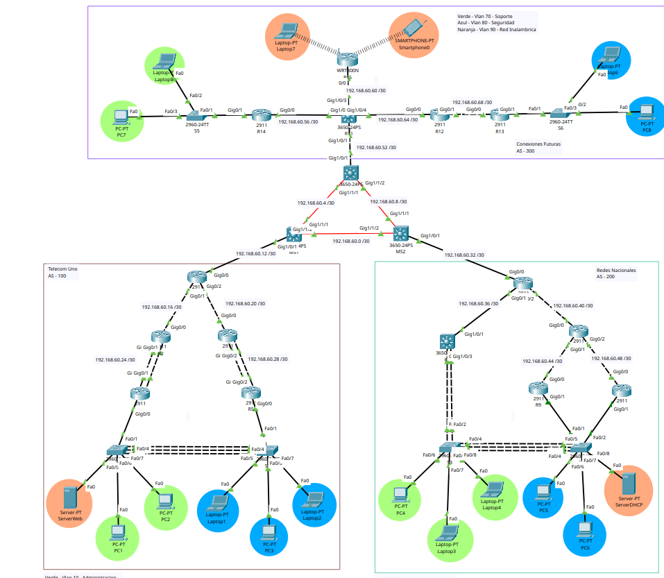

# Proyecto 2 - Redes de Computadoras 2

## Manual Técnico

**Universidad de San Carlos de Guatemala**  
**Facultad de Ingeniería**  
**Escuela de Ciencias**  
**Redes de Computadoras 2**  
**Primer Semestre 2026**

---

**Estudiante:** Diego Alessandro Constanza Padilla  
**Carnet:** 202300601  
**Fecha:** 1 de Mayo 2026

---

## 1. Topología de la Red

A continuación se presenta el diagrama general de la topología implementada en Packet Tracer, la cual consta de un Core central que interconecta tres Sistemas Autónomos (AS) distintos utilizando BGP. Cada AS tiene una topología y enrutamiento interno específico.



*NOTA: El diagrama ilustra las conexiones del Core, así como la distribución en Árbol (AS 100), Jerárquica (AS 200) y Hub-and-Spoke (AS 300).*

---

## 2. Estructura y Direccionamiento

La red general se diseñó utilizando el carnet **202300601** para definir las distintas subredes, bajo el criterio designado en la planificación (`<XX>` equivalente a 01 y `<Y>` equivalente a 1).

### Core
- **Equipos:** 3 Multilayer Switches (MS1, MS2, MS3).
- **Red de enrutamiento:** `192.168.60.0/24` (Subneteo con máscaras `/30` para enlaces punto a punto).
- **Conectividad:** Enlaces Gigabit conformando la zona "Backbone" o Core del modelo.
- **Enrutamiento:** Actúa como columna vertebral para comunicar y redistribuir rutas hacia los extremos mediante **BGP**.

### AS 100 - Telecom Uno
- **Red Base:** `172.16.11.0/24`
- **Topología:** Árbol.
- **Enrutamiento Interno:** OSPF (Área 0).
- **Departamentos (VLANs):**
  - **VLAN 10 (Administración):** `172.16.11.0/26` - 62 hosts.
  - **VLAN 20 (Atención al Cliente):** `172.16.11.64/26` - 62 hosts.
  - **VLAN 30 (Servidores Web):** `172.16.11.128/28` - 14 hosts.
- **Servicios:** En esta zona se aloja el **Servidor Web y DNS** (`172.16.11.130`) con el dominio `www.proyecto2.202300601.com`.

### AS 200 - Redes Nacionales
- **Red Base:** `172.16.21.0/24`
- **Topología:** Jerárquica.
- **Enrutamiento Interno:** OSPF (Área 0).
- **Departamentos (VLANs):**
  - **VLAN 40 (Ventas):** `172.16.21.0/26` - 62 hosts.
  - **VLAN 50 (Facturación):** `172.16.21.64/26` - 62 hosts.
  - **VLAN 60 (Servidores DHCP):** `172.16.21.128/28` - 14 hosts.
- **Redundancia:** Implementación de protocolo **HSRP** para alta disponibilidad de Gateway.
- **Servicios:** Aloja el **Servidor DHCP central** (`172.16.21.135`), el cual envía configuraciones y direccionamiento dinámico a toda la red entera.

### AS 300 - Conexiones Futuras
- **Red Base:** `172.16.31.0/24`
- **Topología:** Hub and Spoke.
- **Enrutamiento Interno:** EIGRP 1.
- **Departamentos (VLANs):**
  - **VLAN 70 (Soporte):** `172.16.31.0/26` - 62 hosts.
  - **VLAN 80 (Seguridad):** `172.16.31.64/26` - 62 hosts.
  - **Red Inalámbrica:** `172.16.31.128/26` conectada por medio de un Wireless Router (SSID: `202300601_WR15`).

---

## 3. Configuraciones y Comandos Implementados

A continuación se detallan y explican los comandos implementados en cada dispositivo de la topología para cumplir con los requerimientos técnicos y de comunicación.

### 3.1 Core (Multilayer Switches)

La capa Core interconecta los tres Sistemas Autónomos mediante BGP. Se habilitó el enrutamiento IP (`ip routing`), se convirtieron los puertos a capa 3 (`no switchport`) y se configuró la redistribución entre los protocolos interiores (OSPF/EIGRP) y BGP.

**MS1 (Frontera AS 100):**
```bash
enab
conf t
no ip domain-lookup
ip routing
! Configuracion capa 3 de las interfaces
interface gig1/0/1
 no switchport
 ip address 192.168.60.13 255.255.255.252
 no shutdown
! OSPF para enlazar con AS 100 interpolando con BGP
router ospf 1
 network 192.168.60.12 0.0.0.3 area 0
 redistribute bgp 100 subnets
! BGP 100 intercomunicando con los AS externos
router bgp 100
 neighbor 192.168.60.2 remote-as 200
 neighbor 192.168.60.6 remote-as 300
 network 172.16.11.0 mask 255.255.255.192
```
*Explicación:* MS1 utiliza `router bgp 100` para publicar las redes del AS 100 y `neighbor` para establecer adyacencia con el AS 200 y 300. Usamos `redistribute bgp` dentro de OSPF para que la red interna conozca las rutas externas.

**MS2 (Frontera AS 200):** Se configura de forma análoga a MS1, usando `router bgp 200` y redistribuyendo hacia su dominio `router ospf 1` con área 0 para conectar el modelo jerárquico de Redes Nacionales.
**MS3 (Frontera AS 300):** Usa `router bgp 300` y redistribuye las rutas con `router eigrp 1`. Dado que redistribuye desde BGP a EIGRP, requiere asignar las métricas correspondientes: `redistribute bgp 300 metric 10000 100 255 1 1500`.

### 3.2 AS 100 - Telecom Uno (Árbol, OSPF)

**Routers R1, R2 y R3 (Distribución):** 
```bash
router ospf 1
 network 192.168.60.16 0.0.0.3 area 0
 network 192.168.60.24 0.0.0.3 area 0

interface range gig0/1-2
 channel-group 1
interface Port-channel 1
 ip address 192.168.60.25 255.255.255.252
```
*Explicación:* Actúan como enlaces troncales utilizando OSPF. Además agrupan sus conexiones físicas para mayor ancho de banda y redundancia usando LACP (`channel-group`).

**Routers R4 y R5 (Router-on-a-Stick):**
```bash
interface gig0/0.10
 encapsulation dot1Q 10
 ip address 172.16.11.1 255.255.255.192
 ip helper-address 172.16.21.135
```
*Explicación:* R4 administra las VLANs 10 y 30 mediante subinterfaces (`.10` y `.30`). La instrucción `encapsulation dot1Q` clasifica el tráfico de la VLAN respectiva, mientras que `ip helper-address 172.16.21.135` reenvía las solicitudes DHCP de las PC al servidor alojado en AS 200.

**Switches S1 y S2 (Acceso):**
```bash
vlan 10
 name Administracion
interface fa0/6
 switchport mode access
 switchport access vlan 10
interface Port-channel 1
 switchport mode trunk
 switchport trunk allowed vlan 10,20,30
```
*Explicación:* Definen las VLANs a nivel de capa 2. Asignan puertos específicos a dispositivos finales (`mode access`) y permiten que los enlaces agregados hacia los Routers distribuyan varias VLANS (`mode trunk`).

### 3.3 AS 200 - Redes Nacionales (Jerárquico, OSPF y HSRP)

**R6, R8 y R7 (Distribución y acceso al Servidor DHCP):**
Utilizan una configuración análoga a AS 100 mediante OSPF. En específico, R7 aloja la VLAN 40 (gateway `172.16.21.1`) que sirve a las estaciones de Ventas, también con `ip helper-address`.

**R9 y R10 (Alta disponibilidad con HSRP):**
```bash
interface gig0/1.50
 encapsulation dot1Q 50
 ip address 172.16.21.66 255.255.255.192
 standby version 2
 standby 50 ip 172.16.21.65
 standby 50 priority 110
 standby 50 preempt
 ip helper-address 172.16.21.135
```
*Explicación:* A nivel de la VLAN 50 y la 60, R9 y R10 comparten una IP virtual (`standby 50 ip 172.16.21.65`). R9 adopta rol Activo gracias a su prioridad más alta (`110`), y `preempt` asegura que recupere su rol si se reactiva tras una caída. R10 queda con prioridad por defecto (100) en estado Listen/Standby.

**Switches S3 y S4 (Acceso):**
Agregan configuración de EtherChannel capa 2 (`channel-group 1 mode active` y trunk) y declaran las VLANs 40, 50, y 60 en sus respectivos puertos de acceso.

### 3.4 AS 300 - Conexiones Futuras (Hub & Spoke, EIGRP)

**R11 a R14 (Enrutamiento EIGRP):**
```bash
router eigrp 1
 network 192.168.60.52 0.0.0.3
 no auto-summary
```
*Explicación:* Implementan el protocolo EIGRP con el identificador del Sistema Autónomo 1, declarando las subredes conectadas de manera local. Se usa `no auto-summary` para prevenir ruteos incorrectos a nivel de las fronteras de red con saltos classless.

**R13 y R14 (VLANs Spoke):**
Funcionan como endpoints del modelo que hospedan con dot1Q las subinterfaces para la red Soporte (Vlan 70, red 172.16.31.0/26) y Seguridad (Vlan 80, red 172.16.31.64). Ambas portan la dirección de helper para consultar el DHCP.

**WR15 (Wireless Router):**
A diferencia de los dispositivos anteriores, se configuró desde GUI simulando el router Inalámbrico para crear el segmento WiFi `172.16.31.128/26`. El SSID proveído fue `202300601_WR15` con clave WPA2 `202300601`. Este dispositivo sirve tráfico hacia la red principal haciendo uso del IP Dinámico `192.168.60.62` como su interfaz de internet conectada a R11.

---

### 3.5 Control de Acceso: Listas de Acceso (ACLs)

Las Políticas de comunicación documentadas en el siguiente inciso fueron implementadas limitando el paso de flujos con ACLs. Algunas de estas reglas clave incluyen:

```bash
! Restricciones departamentales en el R4 para entrada origen/destino
ip access-list extended FILTRO_ENTRADA_ADMIN
 permit icmp any 172.16.11.0 0.0.0.63 echo-reply
 permit tcp any 172.16.11.0 0.0.0.63 established
 permit ip 172.16.31.0 0.0.0.63 172.16.11.0 0.0.0.63
 deny ip 172.16.11.64 0.0.0.63 172.16.11.0 0.0.0.63 
 deny ip 172.16.21.0 0.0.0.63 172.16.11.0 0.0.0.63  
 permit ip any any
```
*Explicación:* Se utilizan Listas de Control de Acceso Extendidas, que permiten definir tanto dirección de Origen como Destino. Por ejemplo, `permit udp any any eq bootps` se añadió en la mayoría para no interrumpir el DHCP. 
Específicamente el bloque de **Seguridad (ACL_SEGURIDAD_PROTECT)** incluye `deny ip any 172.16.31.64 0.0.0.63`, y explícitamente permite conexiones `established` o `echo-reply` para habilitarle consultar internet o tráfico saliente sin perturbar el bloqueo pasivo general de entrada hacia Seguridad.

---

## 4. Políticas de Comunicación

Toda la comunicación Inter-AS se apoya en listas y reglas de la topología:
- **Componentes con comunicación total (Entrada/Salida con todos):** Servidores Web, Servidores DHCP, Soporte, Administración, Red Inalámbrica.
- **Políticas Restrictivas:**
  - **Seguridad:** Tiene capacidad de enviar tráfico hacia el resto de la red (Salida), pero bloquea por completo peticiones entrantes.
  - **Atención al Cliente y Facturación:** Comunicación completamente aislada, de modo que *solo pueden contactarse con el departamento de Ventas*.
  - **Ventas:** Comunicación de entrada y salida únicamente permitida con Facturación y Atención al Cliente.
